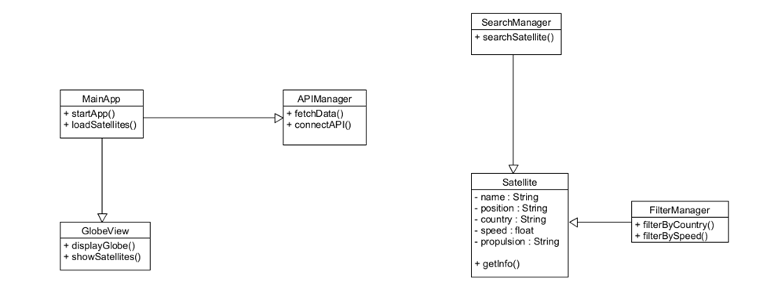
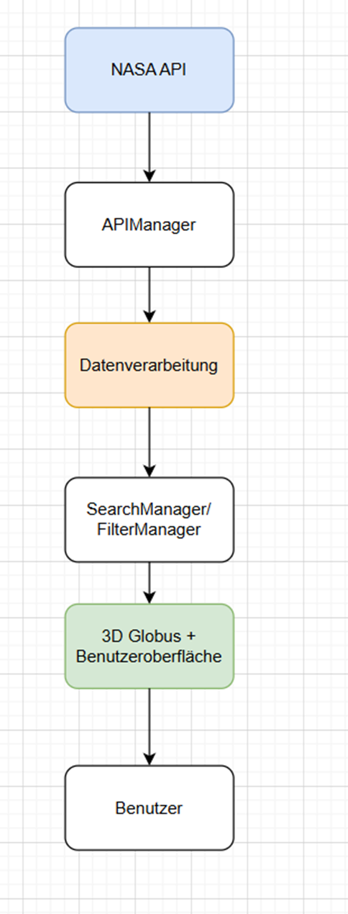

# 1. Teil (Obligatorische Kapitel)
## 1.1 Aufgabenstellung

### Ausgangslage
Hunderte wenn nicht Tausende von Satelliten kreisen um die Erde. Manche zeigen dir deine Position, manche beobachten die Sterne und manche kommunizieren die neusten News. Manche dieser Satelliten kann man sogar von Auge im Himmel sehen. Was jedoch mit denjenigen die man nicht von Auge sehen kann? Diese kann man als Laie nur schwer selber finden. 
Daher bieten teils Anbieter HTTP APIs die die Live-Positionen aller Satelliten beobachten können und im JSON format an den Nutzer schicken.

### Detaillierte Aufgabenstellung
Als raumfahrt-interessierter Laie möchte ich mich über die Position von unterschiedlichsten Satelliten informieren. Dafür möchte ich einen Web Tracker zur Verfolgung von Satelliten in Echtzeit verwenden. Der Tracker soll es Nutzerinnen und Nutzern ermöglichen, aktuelle Positionen von Satelliten zu visualisieren, deren Flugbahnen nachzuvollziehen und relevante Informationen wie Name, Position, Land, Geschwindigkeit und Antriebsart zu sehen.
Im Projekt soll dies durch die Nutzung öffentlich verfügbarer Satellitendaten (z. B. NASA API https://sscweb.gsfc.nasa.gov/WebServices/REST/) umgesetzt werden. 
Diese Daten werden verarbeitet und in einer benutzerfreundlichen Oberfläche dargestellt mit Übersicht von Name, Position, Land, Geschwindigkeit, Antriebsart werden.
Die Anwendung soll als Web -App entwickelt werden. 

#### Funktionale Anforderungen:
- 1	Es soll eine Kartenansicht (Globus) integriert werden.
- 2	Es soll eine Suchoption integriert werden mit der man nach beliebige Satelliten suchen kann.
- 3	Es soll eine Filteroption integriert werden mit der man nach Name, Position, Land, Geschwindigkeit, Antriebsart und Funktion filtern kann.
- 4	Die Visualisierung erfolgt in 3D mit Hilfe eines Globus.
- 5 Es können mindestens 10 Satelliten parallel zu einander angezeigt werden
- 6 Die Applikation soll ohne ein Backend auskommen
- 7 Die Applikation soll ohne ein Login auskommen
- 8 Die Applikation soll Web-Basiert sein um sie zugänglicher zu mehr Nutzern zu machen

## 1.2 Projektorganisation
Dieses Projekt ist als übungsdurchlauf für die tatsächliche IPA gedacht und so sind die Projektanforderungen von uns an uns gestellt worden. Unser Betreuer für dieses Projekt ist Herr Colic der BBBaden. Er ist zudem auch unser Hauptexperte. Wir Absolvieren die IPA an der BBBaden sowie via Home Office. 

Unser Projektmanagement basiert auf IPERKA da es uns so Vorgegeben wurde und es auch für dieses Projekt der "Path of least resistance" ist. S

## 1.3 Deklaration der Vorkenntnisse
- HTML/CSS: Gute Kenntnisse -> Umsetzung von statischen Web-basierten Projekten.
- JS/TS: Gute Kenntnisse -> Umsetzung von nicht-statischen Webprojekten
- Docker: Gute Kenntnisse -> Bearbeiten des jeweiligen Moduls
...

## 1.4 Deklaration der Vorarbeiten
Als Vorbereitung auf diesen Test-Run der IPA haben wir uns nicht direkt Vorbereitet. Während wir jeweils schon neue Technologien gelernt haben (z.b Svelte) erwarten wir nicht dass diese bei der IPA von grossem nutzen sein werden.

## 1.5 Deklaration der benützten Firmenstandards
Diese Dokumentation ist stark von der Beispieldokumentation auf Moodle inspiriert. Das Arbeitsjournal ist ein Standardisiertes von uns erstelltes Formular (siehe Zeitplan.xlsx).
...

## 1.6 Zeitplan

*todo ersetzen mit aktuellster version*

## 1.7 Arbeitsjournal
*todo insert von arbeitsjournal*

# 2. Teil (Projekt Dokumentation)
## 2.1 Kurzfassung des IPA Berichts

### Ausgangssituation:
Zurzeit können Satelliten nur von Auge am Nachthimmel oder über indirekte Tabellen/JSON files gefunden werden. Um einen sauberen und schön aussehenden überblick über diese zu erhalten wurde die Idee entwickelt, eine Web-Applikation zu entwickeln welche anhand eines 3D Globus die Position der Satelliten visualisiert. 

### Umsetzung
Für die Umsetzung entschieden wir uns für "plain" HTML/CSS/JS da es uns allen Bekannt ist. Für das rendern von 3D Objekten entschieden wir uns für ThreeJS da es unsere Anforderungen an das rendering von 3D Objekten perfekt erfüllt. Die Applikation wird aus einem Docker Container aus laufen so dass die Software modular deployed werden kann. 

### Ergebnis
Zum Schluss können Nutzer auf die Web-Page ohne Login zugreifen. Auf der Landing-Page sieht man ersteinmals den Globus mit einigen Beispielsatelliten auf ihrem Orbit. Mit einem Filtertool kann man dann Satelliten ein/ausblenden und sich über einen Click auf den Satellit informieren. 

## 2.2 Informieren
### 2.2.1 REST API
Für die Informationsbeschaffung der Webseite verwenden wir eine REST API. Diese muss die passenden Informationen in passender form liefern. Hierfür haben wir einige Ansätze für passende APIs, müssen uns jedoch noch für eine passende entscheiden. Am besten könnte diese API auch schon das Filtern übernehmen

### 2.2.2 Design der Seite
Für das Design der Seite wollen wir ein 3D orientiertes dynamisches Design. Wichtig ist jedoch auch dass bei einem solchen Design die Webseite Optimiert bleibt und nicht Lagt da dies die Nutzererfahrung signifikant schädigen würde. 
Für dies werden wir uns auf die Optimierung der Library stützen so dass alle Objekte schnell und effektiv dargestellt werden können. Falls dies nicht der Fall ist müssen wir an der menge von 3D Objekten sparen oder einen weg finden die Datenmenge zu Reduzieren.

### 2.2.3 User Experience
Zur Sicherstellung einer guten Nutzererfahrung wird die Seite nach den Kriterien der ISO 9241-110 umgesetzt.

#### Aufgabenangemessenheit
Mit nur einer Hauptseite und kleineren Subtools kann der Nutzer die Webseite klar und schnell navigieren. 

#### Selbstbeschreibungsfähigkeit
Die Seite ist so designt dass alle features (z.b das Informieren über einen Satelliten via Click auf denjenigen) offensichtlich und erwartbar sind. Das filtermenü ist angemessen betitelt so dass man seinen Nutzen versteht.

#### Lernförderlichkeit
Durch die Limitierten Interaktionen die die Seite anbietet kann sich der Nutzer nicht verirren und kann immer über die Themen lernen die Ihn interessieren.

#### Steuerbarkeit
Der Nutzer kann den Detailgrad und die Menge der aktuell angezeigten Informationen mit dem Filtertool leicht und effektiv bestimmen.

#### Erwartungskonformität
Die Satelliten werden in 3D form angezeigt was den Erwartungen des Nutzers zur Darstellung eines Satelliten entspricht. Zudem machen die Filtertabellen genau das was man erwartet.

#### Individualisierbarkeit
Durch das Filtermenü kann der Nutzer konfigurieren wie viele und welche Satelliten ihm angezeigt werden.

#### Fehlertoleranz
Das ausführen eines Fehlers ist aufgrund der simplen Interaktion so gut wie Unmöglich. Fehler der API werden effektiv abgefangen und angezeigt.

### 2.2.4 Bewertung IPA
Die IPA wird natürlich nach den gegebenen Kriterien optimiert und gewertet. Daher stellen wir sicher dass die Finale Abgabe auch sämtlichen Anforderungen entspricht.

*hier nochmals die Anforderungen*
- 1	Es soll eine Kartenansicht (Globus) integriert werden.
- 2	Es soll eine Suchoption integriert werden mit der man nach beliebige Satelliten suchen kann.
- 3	Es soll eine Filteroption integriert werden mit der man nach Name, Position, Land, Geschwindigkeit, Antriebsart und Funktion filtern kann.
- 4	Die Visualisierung erfolgt in 3D mit Hilfe eines Globus.
- 5 Es können mindestens 10 Satelliten parallel zu einander angezeigt werden
- 6 Die Applikation soll ohne ein Backend auskommen
- 7 Die Applikation soll ohne ein Login auskommen
- 8 Die Applikation soll Web-Basiert sein um sie zugänglicher zu mehr Nutzern zu machen

## 2.3 Planen

### 2.3.1 Testkonzept
Ziel: Die Anwendung soll auf Funktionalität, Stabilität und Benutzerfreundlichkeit getestet werden.
Funktionstest: Überprüfung der Such-, Filter- und Anzeige-Funktionen.
API-Test: Kontrolle der Verbindung zur NASA API und korrekte Datenübernahme.
Benutzertest: Prüfung der Benutzeroberfläche und Bedienbarkeit.
Fehlertest: Überprüfung des Verhaltens bei fehlender Internetverbindung oder API-Fehlern.
Leistungstest: Kontrolle, ob mindestens 10 Satelliten gleichzeitig dargestellt werden können.

//??//

### 2.3.2 Testfallspezifikation
Wir erstellten Testfälle um unser Projekt effektiv testen zu können und um herauszufinden wenn wir die von uns gesetzten Ziele erreicht haben. Hierfür erstellten wir 6 Passende Testfälle und sie beziehen sich direkt auf unsere Anforderungen

| Nr | Anforderung                       | Test                       | Erwartetes Ergebnis                                                           |
|----|-----------------------------------|----------------------------|-------------------------------------------------------------------------------|
| 1  | Mindestens 10 Satelliten anzeigen | 10 Satelliten laden        |     Mindestens 10 Satelliten werden angezeigt                                 |
| 2  | Suchfunktion                      | Nach Satellitenname suchen |     Der richtige Satellit wird angezeigt                                      |
| 3  | Filterfunktion                    | Nach Land filtern          |     Nur Satelliten des gewählten Landes erscheinen                            |
| 4  | 3D-Globus                         | Globus öffnen              |     Satelliten werden auf dem 3D-Globus dargestellt                           |
| 5  | API-Verbindung                    | API abrufen                |     Daten werden erfolgreich geladen                                          |
| 6  | Informationsanzeige               | Satellit auswählen         |     Name, Position, Land, Geschwindigkeit und Antriebsart werden angezeigt    |

### 2.3.3

Obwohl unsere Applikation in JavaScript läuft entschieden wir uns unsere Applikation nach den Grundsätzen der Objekt Orientierten Programmierung zu Gruppieren. Mit der grossen Datenmenge mit der wir arbeiten ist das eine Notwendigkeit. 

### 2.3.4
Die Interaktion zwischen der API und dem Fertigen UI ist eine der wichtigsten Anteile. Daher entschieden wir uns die Daten nach einer Art "Pipeline" zu gruppieren in der sie von der API unterschiedliche Komponenten durchläuft bis die Daten am Schluss angezeigt werden können.

## 2.4 Entscheiden

Wir mussten uns nur noch entscheiden welche API wir genau verwenden wollten. Da es einige zur Auswahl gab wollten wir die Schnittstelle finden die am besten für unsere Zwecke passt.

Hierfür wollten wir erstmals unsere Prioritäten setzen, dafür verwendeten wir eine Präferenzmatrix.

A ->	Entwicklungsaufwand

B ->	Performance

C ->	Genauigkeit der Satellitenposition

D ->	Erweiterbarkeit

|     A vs B    |     A    |
|---------------|----------|
|     A vs C    |     A    |
|     A vs D    |     A    |
|     B vs C    |     C    |
|     B vs D    |     D    |
|     C vs D    |     C    |

Dies bringt uns zum folgenden Resultat:

|      Kriterium                              |      Rang     |      Prozent     |
|---------------------------------------------|---------------|------------------|
|     Entwicklungsaufwand                     |     1         |     50%          |
|     Genauigkeit   der Satellitenposition    |     2         |     0%           |
|     Erweiterbarkeit                         |     3         |     33%          |
|     Performance                             |     4         |     17%          |

Nun können wir daraus eine Vergleichsmatrix etablieren

|      Kriterium                            |      Gewichtung     |      NASA API     |      GTN     |      CelesTrak + sgp4     |      GTN     |      Externe Plattform     |      GTN     |
|-------------------------------------------|---------------------|-------------------|--------------|---------------------------|--------------|----------------------------|--------------|
|     Entwicklungsaufwand                   |     50%             |     1             |     50       |     1                     |     50       |     2                      |     100      |
|     Performance                           |     0%              |     1             |     0        |     2                     |     0        |     0                      |     0        |
|     Genauigkeit der Satellitenposition    |     33%             |     2             |     66       |     2                     |     66       |     1                      |     33       |
|     Erweiterbarkeit                       |     17%             |     1             |     17       |     2                     |     34       |     0                      |     0        |

Das heisst wenn man die Punkte nun auflistet erhält man:

|      Variante            |            |      Punkte     |
|--------------------------|------------|-----------------|
|     CelesTrak + sgp4     |            |     150         |
|     NASA API             |            |     133         |
|     Externe Plattform    |            |     133         |

Fazit: Das CelesTrak API passt für unseres Projekt am besten wegen eine simplere return Struktur (einfacher zu parsen) und ganz simpel eine Endpoint die wir benötigen.

## 2.5 Realisieren
////
