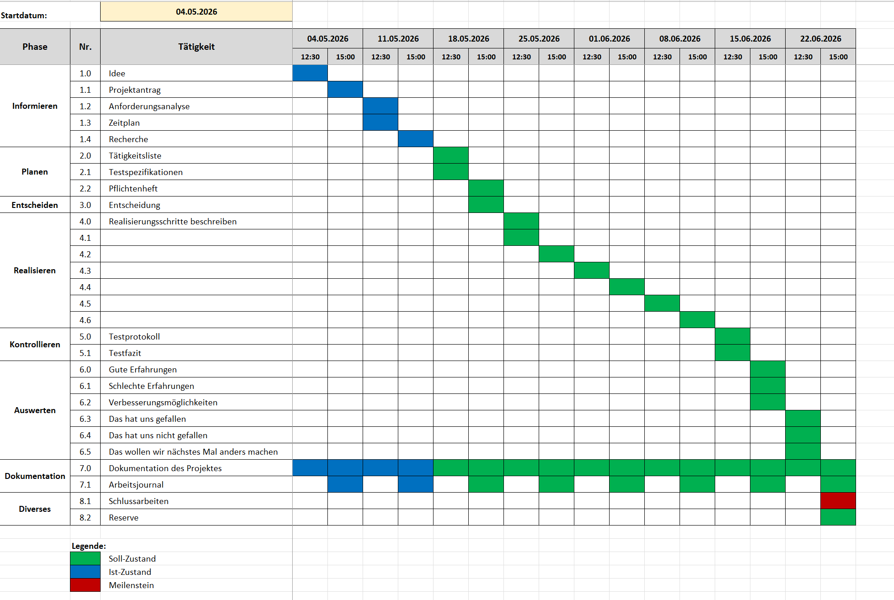

# 1. Teil (Obligatorische Kapitel)
## 1.1 Aufgabenstellung

### Ausgangslage
Hunderte wenn nicht Tausende von Satelliten kreisen um die Erde. Manche zeigen dir deine Position, manche beobachten die Sterne und manche kommunizieren die neusten News. Manche dieser Satelliten kann man sogar von Auge im Himmel sehen. Was jedoch mit denjenigen die man nicht von Auge sehen kann? Diese kann man als Laie nur schwer selber finden. 
Die NASA bietet daher eine HTTP API an von der man die Live-Position aller Satelliten beobachten kann und im JSON format an den Nutzer geschickt.

### Detaillierte Aufgabenstellung
Als raumfahrt-interessierter Laie möchte ich mich über die Position von unterschiedlichsten Satelliten informieren. Dafür möchte ich einen Web Tracker zur Verfolgung von Satelliten in Echtzeit verwenden. Der Tracker soll es Nutzerinnen und Nutzern ermöglichen, aktuelle Positionen von Satelliten zu visualisieren, deren Flugbahnen nachzuvollziehen und relevante Informationen wie Name, Position, Land, Geschwindigkeit und Antriebsart zu sehen.
Im Projekt soll dies durch die Nutzung öffentlich verfügbarer Satellitendaten (z. B. NASA API https://sscweb.gsfc.nasa.gov/WebServices/REST/) umgesetzt werden. 
Diese Daten werden verarbeitet und in einer benutzerfreundlichen Oberfläche dargestellt mit Übersicht von Name, Position, Land, Geschwindigkeit, Antriebsart werden.
Die Anwendung soll als Web -App entwickelt werden. 

#### Funktionale Anforderungen:
-	Es soll eine Kartenansicht (Globus) integriert werden.
-	Es soll eine Suchoption integriert werden mit der man nach beliebige Satelliten suchen kann.
-	Es soll eine Filteroption integriert werden mit der man nach Name, Position, Land, Geschwindigkeit, Antriebsart und Funktion filtern kann.
-	Die Visualisierung erfolgt in 3D mit Hilfe eines Globus.
-   Es können mindestens 10 Satelliten parallel zu einander angezeigt werden
-   Die Applikation soll ohne ein Backend auskommen
-   Die Applikation soll ohne ein Login auskommen
-   Die Applikation soll Web-Basiert sein um sie zugänglicher zu mehr Nutzern zu machen

## 1.2 Projektorganisation
Dieses Projekt ist als übungsdurchlauf für die tatsächliche IPA gedacht und so sind die Projektanforderungen von uns an uns gestellt worden. Unser Betreuer für dieses Projekt ist Herr Colic der BBBaden. Er ist zudem auch unser Hauptexperte. Wir Absolvieren die IPA an der BBBaden sowie via Home Office. 

Unser Projektmanagement basiert auf IPERKA da es uns so Vorgegeben wurde und es auch für dieses Projekt der "Path of least resistance" ist. S

## 1.3 Deklaration der Vorkenntnisse
- HTML/CSS: Gute Kenntnisse -> Umsetzung von statischen Web-basierten Projekten.
- JS/TS: Gute Kenntnisse -> Umsetzung von nicht-statischen Webprojekten
- Docker: Gute Kenntnisse -> Bearbeiten des jeweiligen Moduls
...

## 1.4 Deklaration der Vorarbeiten
Als Vorbereitung auf diesen Test-Run der IPA haben wir uns nicht direkt Vorbereitet. Während wir jeweils schon neue Technologien gelernt haben (z.b Svelte) erwarten wir nicht dass diese bei der IPA von grossem nutzen sein werden.

## 1.5 Deklaration der benützten Firmenstandards
Diese Dokumentation ist stark von der Beispieldokumentation auf Moodle inspiriert. Das Arbeitsjournal ist ein Standardisiertes von uns erstelltes Formular (siehe Zeitplan.xlsx).
...

## 1.6 Zeitplan

*todo ersetzen mit aktuellster version*

## 1.7 Arbeitsjournal
*todo insert von arbeitsjournal*

# 2. Teil (Projekt Dokumentation)
## 2.1 Kurzfassung des IPA Berichts

### Ausgangssituation:
Zurzeit können Satelliten nur von Auge am Nachthimmel oder über indirekte Tabellen/JSON files gefunden werden. Um einen sauberen und schön aussehenden überblick über diese zu erhalten wurde die Idee entwickelt, eine Web-Applikation zu entwickeln welche anhand eines 3D Globus die Position der Satelliten visualisiert. 

### Umsetzung