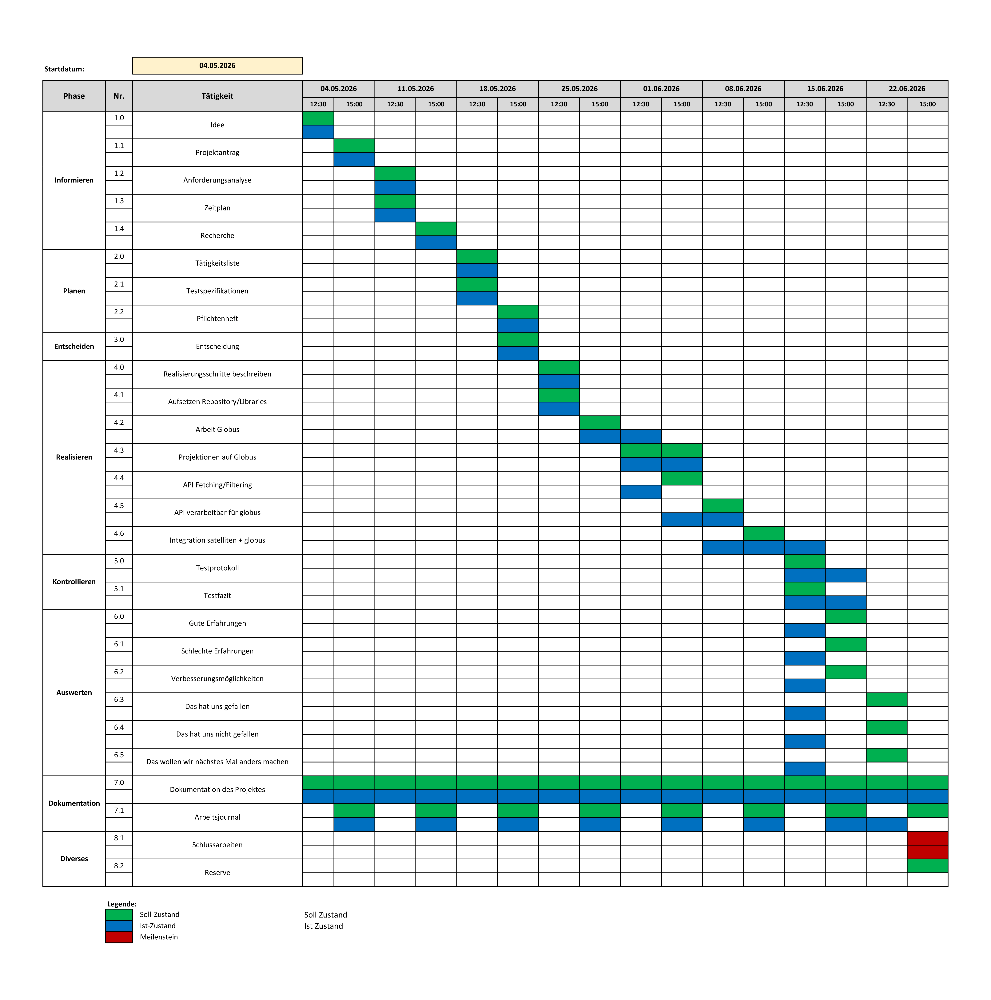
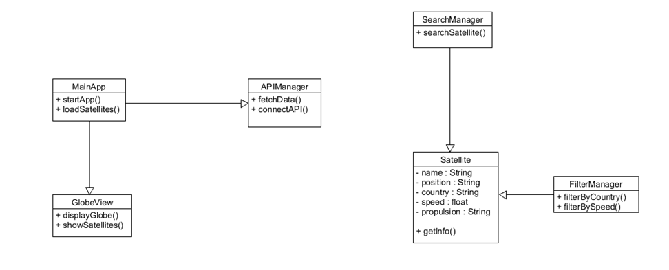
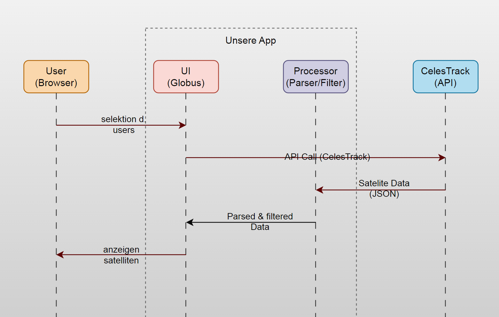
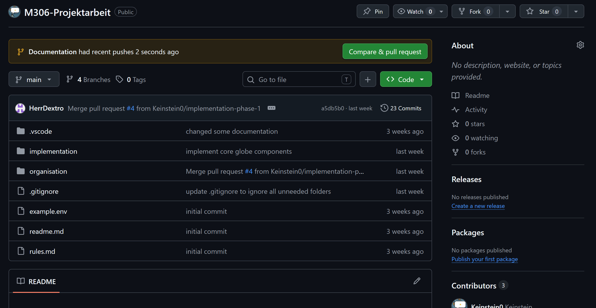
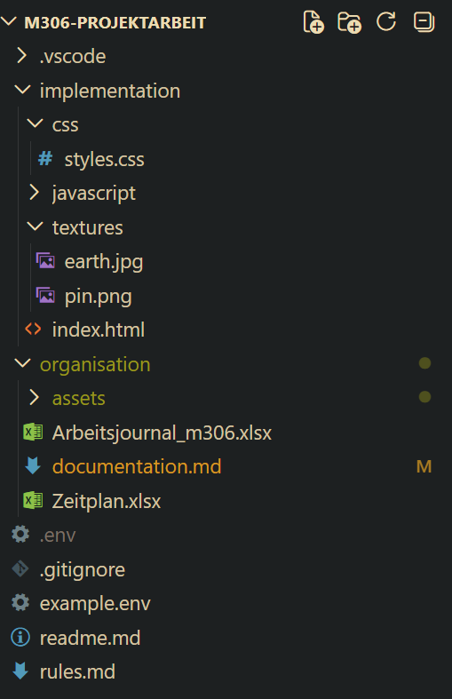
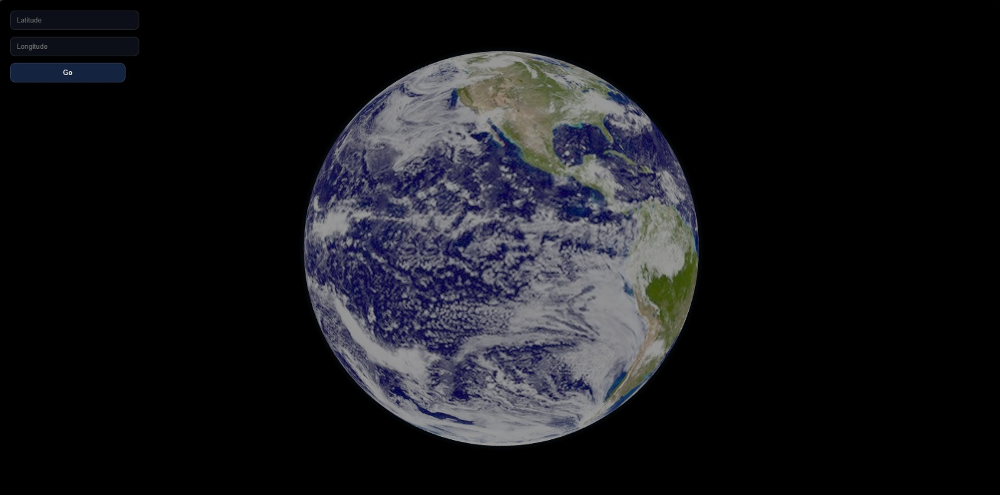

# 1. Teil (Obligatorische Kapitel)
## 1.1 Aufgabenstellung

### Ausgangslage
Hunderte wenn nicht Tausende von Satelliten kreisen um die Erde. Manche zeigen dir deine Position, manche beobachten die Sterne und manche kommunizieren die neusten News. Manche dieser Satelliten kann man sogar von Auge im Himmel sehen. Was jedoch mit denjenigen die man nicht von Auge sehen kann? Diese kann man als Laie nur schwer selber finden. 
Daher bieten teils Anbieter HTTP APIs die die Live-Positionen aller Satelliten beobachten können und im JSON format an den Nutzer schicken.

### Detaillierte Aufgabenstellung
Als raumfahrt-interessierter Laie möchte ich mich über die Position von unterschiedlichsten Satelliten informieren. Dafür möchte ich einen Web Tracker zur Verfolgung von Satelliten in Echtzeit verwenden. Der Tracker soll es Nutzerinnen und Nutzern ermöglichen, aktuelle Positionen von Satelliten zu visualisieren, deren Flugbahnen nachzuvollziehen und relevante Informationen wie Name, Position, Land, Geschwindigkeit und Antriebsart zu sehen.
Im Projekt soll dies durch die Nutzung öffentlich verfügbarer Satellitendaten (z. B. NASA API https://sscweb.gsfc.nasa.gov/WebServices/REST/) umgesetzt werden. 
Diese Daten werden verarbeitet und in einer benutzerfreundlichen Oberfläche dargestellt mit Übersicht von Name, Position, Land, Geschwindigkeit, Antriebsart werden.
Die Anwendung soll als Web -App entwickelt werden. 

#### Funktionale Anforderungen:
- 1	Es soll eine Kartenansicht (Globus) integriert werden.
- 2	Es soll eine Suchoption integriert werden mit der man nach beliebige Satelliten suchen kann.
- 3	Es soll eine Filteroption integriert werden mit der man nach Name, Position, Land, Geschwindigkeit, Antriebsart und Funktion filtern kann.
- 4	Die Visualisierung erfolgt in 3D mit Hilfe eines Globus.
- 5 Es können mindestens 10 Satelliten parallel zu einander angezeigt werden
- 6 Die Applikation soll ohne ein Backend auskommen
- 7 Die Applikation soll ohne ein Login auskommen
- 8 Die Applikation soll Web-Basiert sein um sie zugänglicher zu mehr Nutzern zu machen

## 1.2 Projektorganisation
Dieses Projekt ist als übungsdurchlauf für die tatsächliche IPA gedacht und so sind die Projektanforderungen von uns an uns gestellt worden. Unser Betreuer für dieses Projekt ist Herr Colic der BBBaden. Er ist zudem auch unser Hauptexperte. Wir Absolvieren die IPA an der BBBaden sowie via Home Office. 

Unser Projektmanagement basiert auf IPERKA da es uns so Vorgegeben wurde und es auch für dieses Projekt der "Path of least resistance" ist. 

## 1.3 Deklaration der Vorkenntnisse
- HTML/CSS: Gute Kenntnisse -> Umsetzung von statischen Web-basierten Projekten.
- JS/TS: Gute Kenntnisse -> Umsetzung von nicht-statischen Webprojekten
- Docker: Gute Kenntnisse -> Bearbeiten des jeweiligen Moduls
...

## 1.4 Deklaration der Vorarbeiten
Als Vorbereitung auf diesen Test-Run der IPA haben wir uns nicht direkt Vorbereitet. Während wir jeweils schon neue Technologien gelernt haben (z.b Svelte) erwarten wir nicht dass diese bei der IPA von grossem nutzen sein werden.

## 1.5 Deklaration der benützten Firmenstandards
Diese Dokumentation ist stark von der Beispieldokumentation auf Moodle inspiriert. Das Arbeitsjournal ist ein Standardisiertes von uns erstelltes Formular (siehe Zeitplan.xlsx).
...

## 1.6 Zeitplan

## 1.7 Arbeitsjournal

| Datum | 04.05.2026 | 11.05.2026 | 18.05.2026 | 01.06.2026 | 08.06.2026 | 15.06.2026 |
|:---|:---|:---|:---|:---|:---|:---|
| **Neo** | | | | | | |
| **Geplante Tätigkeiten** | | Arbeitsvorlage erstellen | 7708 Entscheiden | JS API parses für CelesTrak | JS für Api fertigmachen | Fertigmachen App |
| **Erfolge** | | Erstellt und Tag 1 für alle eingetragen | Nutzwertanalyse und Präferenzmatrix gemacht, ergebnis war tatsächlich das beste | JS basisprogramm existiert, API daten können als sauberes JSON ausgegeben werden und sortiert werden. | JS funktioniert | Code zusammengetan |
| **Misserfolge** | | Excel ist nervig, und für dieser Auftrag würde es meiner Meinung nach mehr Sinn ergeben, die Arbeitsjournale individuell zu machen | Andere hat Doku zusammengestellt, lag weniger gut in der Zeit | Ich war ein bisschen rusty in JS, was dazu führte dass ich weniger schnell bugs finden konnte. | War leicht zu spät mit abgabe, weil ich dachte dass der Code nicht richtig war | Heute arbeiten, da hinter zeitplan |
| **Probleme** | | Keine | Projektantrag stimmt nicht überein mit neues Plan | Keine Nennenswerte | CelesTrak verbannt alle, die mehr als gefühlt 1 Request pro 2 Stunden machen, wodurch mein Code nicht funktionierte/untestbar war | Git |
| **Hilfestellung** | | Keine Hilfe notwendig | keine | ChatGPT, W3Schools JS | ChatGPT | ChatGPT |
| **Überzeiten** | | Kein Überzeit (die Aufträge von heute waren sehr kurz) | keine | 1 Stunde (Arbeit war nicht definiert am Anfang) | 15 Minuten | Keine |
| **Ungeplante Tätigkeiten** | | Keine | Arbeitsjournal für andere ausfüllen | keine | Keine | Keine |
| **Reflexion** | | Alles war grundsätzlich ok, Wir hätten heute aber besser kommunizieren können, mit der Auftragsverteilung | wir sollten zuerst herausfinden, was von was abhängig ist, oder wie man es so macht dass wir besser parallel arbeiten können | Alles ok, ich kann aber schon vorhersehen dass es eventuell Probleme geben wird mit Api parser/satellite orbit renderer und das 3d frontend | Es war heute nicht so optimal, es gab auch sehr lange Antwortzeiten über Whatsapp, und ich habe zu lange gebraucht wegen JS, wodurch Laurentieu auch warten müsste. | Alles funktionierte grundsätzlich und wir wurden einigermassen fertig, ist aber schade dass wir heute noch code fertig machen mussten |

| Datum | 04.05.2026 | 11.05.2026 | 18.05.2026 | 01.06.2026 | 08.06.2026 | 15.06.2026 |
|:---|:---|:---|:---|:---|:---|:---|
| **Alex** | | | | | | |
| **Geplante Tätigkeiten** | | Mindmap erstellen | Github repo erstellen, master dokumentation erstellen | Hilfe bei programmier arbeit | Arbeit an Dokumentation | Arbeit an Dokumentation |
| **Erfolge** | | Mindmap erstellt | Repo und dokument erstellt | Beim programmieren geholfen | Compiler .md -> .docx | Dokumentation fertig |
| **Misserfolge** | | Keine | | Keine | Compiler brauchte lange | Keine |
| **Probleme** | | Draw.io ist sehr nervig | Doku war von anderen abhängig da ihres Zeug reinmusste | Evtl. nicht in der mitte des Projekts die technologie wechseln | Zeitstress (wir sind hinter zeitplan) | Zeitstress |
| **Hilfestellung** | | Keine | keine | Dokumentation Threejs | Google Gemini | Google Gemini, Claude, r/excel |
| **Überzeiten** | | Keine | keine | Keine | Keine | Keine |
| **Ungeplante Tätigkeiten** | | Keine | keine | Keine | Compiler für .md schreiben | Keine |
| **Reflexion** | | Heute war sehr entspannend. Ich hatte meine Arbeit früh fertig | Heute war es am Anfang nicht ganz klar was wir machen müssten, und wir waren verwirrt wegen die Reihenfolge der Aufträge (7707 zuerst, dann 7707) aber nach gute kommunikation ist alles gelungen | Ich konnte heute einiges über 3js lernen und es war sehr interessant | Heute war es gegen anfang recht langweilig jedoch hatte ich sehr viel spass mit dem Compiler zu word | Heute musste ich nochmals unter ein wenig zeitdruck die Dokumentation irgendwie fertigbekommen, was recht stressig war |

| Datum | 04.05.2026 | 11.05.2026 | 18.05.2026 | 01.06.2026 | 08.06.2026 | 15.06.2026 |
|:---|:---|:---|:---|:---|:---|:---|
| **Laurentiu** | | | | | | |
| **Geplante Tätigkeiten** | | Managen der Auftragsverteilung und heutige Planung (vordass Zeitplan erstellt wurde) | 7707 Planen | UI design | HTML integration mit Globe und Control Panel (und JS von Neo) | |
| **Erfolge** | | Gruppe erfolgreich organisiert und Aufträge Kompiliert/abgegeben | 7707 erfolgreich gemacht | HTML CSS mockup vom UI | Control Panel erstellt | Code fertig |
| **Misserfolge** | | Keine | Keine | Keine | integration nicht fertig | Keine |
| **Probleme** | | Keine | Keine | Problem bei Designänderung, Wireframe aus Draw.io zu SVG ist nervig zu editen | Neo's hatte ein problem | Keine |
| **Hilfestellung** | | Keine | Beim Autrag von Teamkollegen nach eine Meinung | Claude | ChatGpt | ChatGpt |
| **Überzeiten** | | Keine | Keine | Keine | Paar Minuten Wegen Arbeitsjournal (müsste darauf warten dass alle es ausgefüllt haben bevor ich pulle) | Keine |
| **Ungeplante Tätigkeiten** | | Keine, ich habe alles perfekt geplannt. | Keine | HTML skelett für Vincent erstellen | | Keine |
| **Reflexion** | | Heute war sehr positiv. Man Schafft alles, was man schaffen will! | Am Anfang wusste ich nicht welche Methoden etc ich anwenden soll. Aber danach konnte ich mit Hilfe mich entscheiden | Heute war sehr praktisch da wir alle im gleichen Zimmer waren und reden konnten und so | Heute war gut, der Zeitplan war für mehr sehr entspannend | |

| Datum | 04.05.2026 | 11.05.2026 | 18.05.2026 | 01.06.2026 | 08.06.2026 | 15.06.2026 |
|:---|:---|:---|:---|:---|:---|:---|
| **Vincent** | | | | | | |
| **Geplante Tätigkeiten** | | Zeitplan erstellen für die nächsten Wochen bis 22.06.2026 mithilfe der Excel Vorlage | 7709 Realisieren | Start an Projekt | Implementation von Satellitenlogik mit CelesTrak | Code fertigmachen |
| **Erfolge** | | Zeitplan vollständig erstellt | Weitere Überlegungen zur Umsetzung angestellt und Teammitglieder bei der Arbeit unterstützt | Globus implementiert | Erfolgreiche | Projekt läuft |
| **Misserfolge** | | Verzögerung wegen Excel problemen | konnte nicht alles machen weil ich Infos von anderen benötigt habe | Globus implementieren dauerte ewig | Mehrere IP-Bans (kontraproduktiv) | Zeit schlecht eingeteilt |
| **Probleme** | | Excel hat beim speicher random Spalten gelöscht | fehlende Informationen | Koordinatensystem implementieren | IP-Bans, CORS-Blocks, Globus lagt stark | immernoch IP-bans |
| **Hilfestellung** | | Keine | keine | Claude | KI | Claude |
| **Überzeiten** | | Keine | keine | Keine | 30min | Keine |
| **Ungeplante Tätigkeiten** | | Nochmals Vorlage machen wegen Excel Fehler | keine | Keine | Anpassung von requestlogik und implementation von caching um IP-Ban zu verhindern | Keine |
| **Reflexion** | | Heute war am Anfang ein bisschen unorganisiert weil noch nicht alle Kontakt hatten und zuhause waren, aber ziemlich schnell danach ist die Organisation gelungen | Die Kommunikation während der Ganzen Phase war leider nicht allzu gut. Es war deshalb nicht komplett klar was jeder machen sollte. Auch das kaputtgehen meiner SSD war für die Produktivität nicht förderlich. Die Aufträge konnten aber schlussendlich grösstenteils gut gelöst werden sodass wir nun in die Realisierung übergehen können. | Heute ging es organisationsmässig viel besser, da wir alle vor ort waren | Ich bin grundsätzlich gut voran gekommen und bin auch zufrieden mit dem aktuellen Produkt. Leider lagt die Website im Moment stark. Ausserdem hatte ich vergessen am Ende den Code und die aktualisierten Dateien zu pushen. | Ich konnte heute den Code fertigmachen und dann auch noch bei der dokumentation fertigarbeiten. Wir hatten ein leichtes chaos mit git aber es funktionierte eigentlich ok |

# 2. Teil (Projekt Dokumentation)
## 2.1 Kurzfassung des IPA Berichts

### Ausgangssituation:
Zurzeit können Satelliten nur von Auge am Nachthimmel oder über indirekte Tabellen/JSON files gefunden werden. Um einen sauberen und schön aussehenden überblick über diese zu erhalten wurde die Idee entwickelt, eine Web-Applikation zu entwickeln welche anhand eines 3D Globus die Position der Satelliten visualisiert. 

### Umsetzung
Für die Umsetzung entschieden wir uns für "plain" HTML/CSS/JS da es uns allen Bekannt ist. Für das rendern von 3D Objekten entschieden wir uns für ThreeJS da es unsere Anforderungen an das rendering von 3D Objekten perfekt erfüllt. Die Applikation wird aus einem Docker Container aus laufen so dass die Software modular deployed werden kann. 

### Ergebnis
Zum Schluss können Nutzer auf die Web-Page ohne Login zugreifen. Auf der Landing-Page sieht man ersteinmals den Globus mit einigen Beispielsatelliten auf ihrem Orbit. Mit einem Filtertool kann man dann Satelliten ein/ausblenden und sich über einen Click auf den Satellit informieren. 

## 2.2 Informieren
### 2.2.1 REST API
Für die Informationsbeschaffung der Webseite verwenden wir eine REST API. Diese muss die passenden Informationen in passender form liefern. Hierfür haben wir einige Ansätze für passende APIs, müssen uns jedoch noch für eine passende entscheiden. Am besten könnte diese API auch schon das Filtern übernehmen

### 2.2.2 Design der Seite
Für das Design der Seite wollen wir ein 3D orientiertes dynamisches Design. Wichtig ist jedoch auch dass bei einem solchen Design die Webseite Optimiert bleibt und nicht Lagt da dies die Nutzererfahrung signifikant schädigen würde. 
Für dies werden wir uns auf die Optimierung der Library stützen so dass alle Objekte schnell und effektiv dargestellt werden können. Falls dies nicht der Fall ist müssen wir an der menge von 3D Objekten sparen oder einen weg finden die Datenmenge zu Reduzieren.

### 2.2.3 User Experience
Zur Sicherstellung einer guten Nutzererfahrung wird die Seite nach den Kriterien der ISO 9241-110 umgesetzt.

#### Aufgabenangemessenheit
Mit nur einer Hauptseite und kleineren Subtools kann der Nutzer die Webseite klar und schnell navigieren. 

#### Selbstbeschreibungsfähigkeit
Die Seite ist so designt dass alle features (z.b das Informieren über einen Satelliten via Click auf denjenigen) offensichtlich und erwartbar sind. Das filtermenü ist angemessen betitelt so dass man seinen Nutzen versteht.

#### Lernförderlichkeit
Durch die Limitierten Interaktionen die die Seite anbietet kann sich der Nutzer nicht verirren und kann immer über die Themen lernen die Ihn interessieren.

#### Steuerbarkeit
Der Nutzer kann den Detailgrad und die Menge der aktuell angezeigten Informationen mit dem Filtertool leicht und effektiv bestimmen.

#### Erwartungskonformität
Die Satelliten werden in 3D form angezeigt was den Erwartungen des Nutzers zur Darstellung eines Satelliten entspricht. Zudem machen die Filtertabellen genau das was man erwartet.

#### Individualisierbarkeit
Durch das Filtermenü kann der Nutzer konfigurieren wie viele und welche Satelliten ihm angezeigt werden.

#### Fehlertoleranz
Das ausführen eines Fehlers ist aufgrund der simplen Interaktion so gut wie Unmöglich. Fehler der API werden effektiv abgefangen und angezeigt.

### 2.2.4 Bewertung IPA
Die IPA wird natürlich nach den gegebenen Kriterien optimiert und gewertet. Daher stellen wir sicher dass die Finale Abgabe auch sämtlichen Anforderungen entspricht.

*hier nochmals die Anforderungen*
- 1	Es soll eine Kartenansicht (Globus) integriert werden.
- 2	Es soll eine Suchoption integriert werden mit der man nach beliebige Satelliten suchen kann.
- 3	Es soll eine Filteroption integriert werden mit der man nach Name, Position, Land, Geschwindigkeit, Antriebsart und Funktion filtern kann.
- 4	Die Visualisierung erfolgt in 3D mit Hilfe eines Globus.
- 5 Es können mindestens 10 Satelliten parallel zu einander angezeigt werden
- 6 Die Applikation soll ohne ein Backend auskommen
- 7 Die Applikation soll ohne ein Login auskommen
- 8 Die Applikation soll Web-Basiert sein um sie zugänglicher zu mehr Nutzern zu machen

### 2.2.5 Sicherung der Dateien
Um unsere Dateien sicher zu verwalten und die Kollaboration im Code zu gewährleisten verwenden wir Git. So sind alle unsere Versionen des Codes sowie alle Versionen der Dokumentationen sicher aufbewahrt. Unser Repository findet sich hier: 
[github.com/Keinstein0/M306-Projektarbeit](https://github.com/Keinstein0/M306-Projektarbeit)

Unsere Ordnerstruktur enthält die beiden Hauptordner "Organisation" und "Implementation". Im Ordner Organisation findet man die Rohfassungen der Dokumentation sowie die jeweiligen Tabellen für Zeitplan und Arbeitsjournal welche zum Schluss in das Dokument, welches Sie nun lesen übertragen wurde. Im Ordner Implementation findet sich der gesamte Code sauber aufgeteilt.

## 2.3 Planen

### 2.3.1 Testkonzept
Ziel: Die Anwendung soll auf Funktionalität, Stabilität und Benutzerfreundlichkeit getestet werden.
Funktionstest: Überprüfung der Such-, Filter- und Anzeige-Funktionen.
API-Test: Kontrolle der Verbindung zur API und korrekte Datenübernahme.
Benutzertest: Prüfung der Benutzeroberfläche und Bedienbarkeit.
Fehlertest: Überprüfung des Verhaltens bei fehlender Internetverbindung oder API-Fehlern.
Leistungstest: Kontrolle, ob mindestens 10 Satelliten gleichzeitig dargestellt werden können.

Was wir nicht testen ist die Optimierung für ein Deployment auf einem tatsächlichen Server, da für dies schon genug Frameworks vorhanden sind. Insbesondere da wir Native HTML/CSS/JS Schreiben soll ein Deployment keine grosse challenge sein.

### 2.3.2 Testfallspezifikation
Wir erstellten Testfälle um unser Projekt effektiv testen zu können und um herauszufinden wenn wir die von uns gesetzten Ziele erreicht haben. Hierfür erstellten wir 6 Passende Testfälle und sie beziehen sich direkt auf unsere Anforderungen

| Nr | Anforderung                       | Test                       | Erwartetes Ergebnis                                                           |
|----|-----------------------------------|----------------------------|-------------------------------------------------------------------------------|
| 1  | Mindestens 10 Satelliten anzeigen | 10 Satelliten laden        |     Mindestens 10 Satelliten werden angezeigt                                 |
| 2  | Suchfunktion                      | Nach Satellitenname suchen |     Der richtige Satellit wird angezeigt                                      |
| 3  | Filterfunktion                    | Nach Land filtern          |     Nur Satelliten des gewählten Landes erscheinen                            |
| 4  | 3D-Globus                         | Globus öffnen              |     Satelliten werden auf dem 3D-Globus dargestellt                           |
| 5  | API-Verbindung                    | API abrufen                |     Daten werden erfolgreich geladen                                          |
| 6  | Informationsanzeige               | Satellit auswählen         |     Name, Position, Land, Geschwindigkeit und Antriebsart werden angezeigt    |

### 2.3.3 Klassendiagramm

Obwohl unsere Applikation in JavaScript läuft entschieden wir uns unsere Applikation nach den Grundsätzen der Objekt Orientierten Programmierung zu Gruppieren. Mit der grossen Datenmenge mit der wir arbeiten ist das eine Notwendigkeit. 

### 2.3.4 Interaktionsdiagramm
Die Interaktionen arbeiten wie in folgendem UML Interaktionsdiagramm dokumentiert. Der Nutzer greift via das UI auf das UI der Webseite zu. Sobald er eine Anfrage macht um neue Satelliten zu sehen, wird eine HTTP Request an die externe API gemacht, welche uns dann im JSON format eine Ungefilterte Antwort gibt. Diese wird dann von einem Verarbeiter im Hintergrund in eine für uns Nutzbare (gefiltert und neuverpackt) Form gebracht. So kann der Globus im UI dann schliesslich die fertigen Satelliten anzeigen.

## 2.4 Entscheiden

Wir mussten uns nur noch entscheiden welche API wir genau verwenden wollten. Da es einige zur Auswahl gab wollten wir die Schnittstelle finden die am besten für unsere Zwecke passt.

Hierfür wollten wir erstmals unsere Prioritäten setzen, dafür verwendeten wir eine Präferenzmatrix.

A -> Entwicklungsaufwand

B -> Performance

C -> Genauigkeit der Satellitenposition

D -> Erweiterbarkeit

|     A vs B    |     A    |
|---------------|----------|
|     A vs C    |     A    |
|     A vs D    |     A    |
|     B vs C    |     C    |
|     B vs D    |     D    |
|     C vs D    |     C    |

Dies bringt uns zum folgenden Resultat:

|      Kriterium                              |      Rang     |      Prozent     |
|---------------------------------------------|---------------|------------------|
|     Entwicklungsaufwand                     |     1         |     50%          |
|     Genauigkeit   der Satellitenposition    |     2         |     0%           |
|     Erweiterbarkeit                         |     3         |     33%          |
|     Performance                             |     4         |     17%          |

Nun können wir daraus eine Vergleichsmatrix etablieren

|      Kriterium                            |      Gewichtung     |      NASA API     |      GTN     |      CelesTrak + sgp4     |      GTN     |      Externe Plattform     |      GTN     |
|-------------------------------------------|---------------------|-------------------|--------------|---------------------------|--------------|----------------------------|--------------|
|     Entwicklungsaufwand                   |     50%             |     1             |     50       |     1                     |     50       |     2                      |     100      |
|     Performance                           |     0%              |     1             |     0        |     2                     |     0        |     0                      |     0        |
|     Genauigkeit der Satellitenposition    |     33%             |     2             |     66       |     2                     |     66       |     1                      |     33       |
|     Erweiterbarkeit                       |     17%             |     1             |     17       |     2                     |     34       |     0                      |     0        |

Das heisst wenn man die Punkte nun auflistet erhält man:

|      Variante            |            |      Punkte     |
|--------------------------|------------|-----------------|
|     CelesTrak + sgp4     |            |     150         |
|     NASA API             |            |     133         |
|     Externe Plattform    |            |     133         |

Fazit: Das CelesTrak API passt für unseres Projekt am besten wegen eine simplere return Struktur (einfacher zu parsen) und ganz simpel eine Endpoint die wir benötigen.

## 2.5 Realisieren

### 2.5.1 Aufsetzen des Projektes
Zu Beginn mussten wir das Projekt erst einmal erstellen. Hierfür begannen wir damit, ein Git Repository zu erstellen, um uns die Kollaboration später zu vereinfachen und unsere Dateien sicher aufzubewahren. 

Von dort aus clonten wir das Repository auf unsere lokalen Computer und begannen erstmals mit dem Erstellen der Dokumentationsdokumente. (Repository wurde schon in der I-Phase aufgesetzt). Nun erstellten wir die nötigen Ordner im "implementation" Ordner, welcher wieder in drei Ordner aufgeteilt wurde:

* der Ordner "css" enthält alle unsere Stylesheets. 
* der Ordner "javascript" enthält alle unsere JavaScript-Dateien.
* der Ordner "textures" enthält alle notwendigen Assets. 

Zudem gibt es das HTML-Dokument `index.html`, in welchem sich, in nur einer Seite, unsere gesamte Struktur befindet.

### 2.5.2 Entwicklung der Globe Engine
Als zentrale Komponente wurde die Globe-Engine entwickelt. Sie ist für die Initialisierung der ThreeJS-Szene verantwortlich und verwaltet die wichtigsten Elemente wie Szene, Kamera und Renderer. 

* **Implementierung des 3D-Globus:** Für die Darstellung der Erde wurde ein eigener Globe-Komponent erstellt. Dieser erzeugt eine dreidimensionale Kugel und bindet die entsprechenden Erdtexturen ein. Die Trennung in ein eigenes Modul erleichtert spätere Erweiterungen, beispielsweise das Hinzufügen von Satellitenmarkierungen oder weiteren visuellen Ebenen.
* **Entwicklung der Kamerasteuerung:** Um eine intuitive Navigation innerhalb der 3D-Szene zu ermöglichen, wurde eine Kamerasteuerung implementiert. Diese erlaubt das Drehen, Zoomen und Verschieben der Ansicht. Dadurch kann der Benutzer verschiedene Regionen der Erde aus unterschiedlichen Perspektiven betrachten.
* **Verarbeitung geografischer Koordinaten:** Da Satellitendaten üblicherweise in Längen- und Breitengraden bereitgestellt werden, wurde ein Modul zur Umrechnung geografischer Koordinaten entwickelt. Dieses berechnet die entsprechenden Positionen auf der dreidimensionalen Kugeloberfläche und bildet die Grundlage für die spätere Platzierung von Satellitenobjekten.
* **Darstellung der Atmosphäre:** Zur Verbesserung der visuellen Darstellung wurde eine Atmosphärenschicht implementiert. Diese erzeugt einen leichten Leuchteffekt um die Erde und sorgt für ein realistischeres Erscheinungsbild des Globus.

### 2.5.3 Implementation der API
Zur Gewinnung aktueller TLE-Daten (Two-Line Element Sets) wurde ein dediziertes Services-Modul (`satelliteService.js`) entwickelt. Um eine robuste Datenpipeline zu garantieren, wurden parallele Abfragen mit einer Konkurrenzsteuerung implementiert. Dies stellt sicher, dass auch bei potenziellen Netzwerkverzögerungen keine Engpässe entstehen. Die Rohdaten werden bereinigt, Dubletten mittels NORAD-IDs gefiltert und in ein für die Applikation optimiertes Format konvertiert.

### 2.5.4 Integration API & Globus
In diesem Schritt wurden die verarbeiteten Daten mit der Globe-Engine verknüpft. Die Bibliothek `satellite.js` dient dabei als mathematische Basis, um aus den TLE-Sätzen die aktuellen ECI-Koordinaten zu propagieren.

Die Satelliten werden als `THREE.Sprite` gerendert, wobei Icons und Farben dynamisch anhand des Typs zugewiesen werden. Zudem wurde ein System für Flugbahnspuren implementiert, das die vergangenen Positionen visualisiert. Die Benutzeroberfläche wurde eng mit dem `SatelliteManager` verzahnt, um Funktionen wie Raycasting zur Objekt-Interaktion und eine "Follow-Funktion" für die Kamera zu ermöglichen.

### 2.5.5 Zwischenfazit der Realisierung
Die modulare Architektur hat sich als äusserst effektiv erwiesen. Die Trennung von Datenbeschaffung, mathematischer Logik und Rendering ermöglicht eine performante Darstellung von mehreren hundert Objekten in Echtzeit und bildet ein solides Fundament für die anstehende finale Testphase. 

## 2.6 Kontrollieren

!insert testbericht

## 2.7 Auswerten

### 2.6.1 Reflexion über die Arbeit
Alles in allem konnten wir in diesem Projekt viel über die Arbeit in einem Projekt lernen. Wie man im Zeitplan möglicherweise sieht hatten wir insbesondere gegen ende eine gute Verzögerung gegenüber dem Soll Zeitplan. Daher mussten wir noch bis zum Schluss vollgas geben und fertig arbeiten. Wie oft gesagt ist man jedoch im Nachhinein immer schlauer und daher würden wir, wenn wir von neuem Anfangen müssten, uns definitiv anders strukturieren. Im Code und für das Dokumentieren könnten wir das erlernte aus dem Agile-Modul anwenden und unseren Code mit Agilen Methoden entwickeln. Wir konnten damit in einer ähnlichen Projektarbeit im BPMN Modul gute Erfahrungen machen.

Zudem könnten wir definitiv noch mehr "Produktorientiert" arbeiten statt dass wir, wie jetzt, "Dokumentationsorientiert" arbeiteten. Wir investierten sehr viel zeit darauf alles für die Dokumentation möglichst effektiv umzusetzen und es war auch Organisatorisch im mittelpunkt. Das hiess dass beim tatsächlichen Codeprojekt es viel Chaotischer und Ineffizienter von statten ging.

### 2.6.2 Schlusswort
Zum Schluss wollten wir noch einige abschliessende Worte formulieren. Für uns war es eine sehr lehrreiche Erfahrung. Wenn auch nicht nur im Programmieren sondern auch im Organisieren konnten wir viele neue Erfahrungen machen. Wir wissen jetzt wie es ist in einem Team auf eine Deadline hin zu arbeiten und können dieses Wissen in unserer Zukunft verwenden. 
Wir hoffen nun dass wir rechtzeitig abgeben können und dann eine saubere Präsentation vorzeigen können.

## 2.8 Quellenverzeichnis

1. NASA Space Physics Data Facility –> REST Web Services  
   [https://sscweb.gsfc.nasa.gov/WebServices/REST/](https://sscweb.gsfc.nasa.gov/WebServices/REST/)

2. CelesTrak –> Aktuelle Satellitendaten und TLE-Dateien  
   [https://celestrak.org/](https://celestrak.org/)

3. Three.js Dokumentation  
   [https://threejs.org/docs/](https://threejs.org/docs/)

4. satellite.js Dokumentation  
   [https://github.com/shashwatak/satellite-js](https://github.com/shashwatak/satellite-js)

5. MDN Web Docs – Fetch API und JavaScript  
   [https://developer.mozilla.org/](https://developer.mozilla.org/)

6. Git Dokumentation  
   [https://git-scm.com/doc](https://git-scm.com/doc)

7. ISO 9241-110 – Grundsätze der Dialoggestaltung
   [https://www.iso.org/standard/77520.html](https://www.iso.org/standard/77520.html)

## 2.9 Glossar

| Begriff | Erklärung |
|---------|-----------|
| API (Application Programming Interface) | Schnittstelle, über welche Programme Daten oder Funktionen austauschen können. |
| REST API | Web-Schnittstelle, welche HTTP-Anfragen verwendet und Daten häufig im JSON-Format liefert. |
| HTTP | Protokoll zur Kommunikation zwischen Webbrowsern und Webservern. |
| JSON | Leichtgewichtiges Datenformat zum Austausch strukturierter Informationen. |
| TLE (Two-Line Element Set) | Standardformat zur Beschreibung der Umlaufbahn eines Satelliten. |
| NORAD-ID | Weltweit eindeutige Identifikationsnummer eines Satelliten. |
| Orbit | Umlaufbahn eines Satelliten um die Erde. |
| ECI-Koordinaten | Earth-Centered Inertial Koordinatensystem zur Berechnung von Satellitenpositionen. |
| Geografische Koordinaten | Beschreibung eines Ortes durch Breiten- und Längengrad. |
| Rendering | Berechnung und Darstellung einer grafischen Szene durch den Computer. |
| 3D-Globus | Dreidimensionale Darstellung der Erde zur Visualisierung von Satellitenpositionen. |
| Three.js | JavaScript-Bibliothek zur Erstellung interaktiver 3D-Grafiken im Browser. |
| satellite.js | JavaScript-Bibliothek zur Berechnung von Satellitenpositionen aus TLE-Daten. |
| Sprite | Zweidimensionales Objekt, das in einer 3D-Szene dargestellt wird. |
| Raycasting | Verfahren zur Erkennung, welches Objekt der Benutzer mit der Maus auswählt. |
| User Experience (UX) | Gesamteindruck und Benutzererlebnis bei der Verwendung einer Anwendung. |
| ISO 9241-110 | Internationale Norm für Grundsätze der benutzerfreundlichen Dialoggestaltung. |
| Docker | Plattform zur Ausführung von Anwendungen in isolierten Containern. |
| Git | Versionsverwaltungssystem zur Nachverfolgung von Änderungen im Quellcode. |
| Repository | Speicherort eines Git-Projekts mit allen Dateien und Versionsinformationen. |
| Frontend | Teil einer Anwendung, mit dem der Benutzer direkt interagiert. |
| Backend | Serverseitiger Teil einer Anwendung. In diesem Projekt wird bewusst kein Backend verwendet. |
| Caching | Zwischenspeichern von Daten, um wiederholte Anfragen zu beschleunigen und APIs zu entlasten. |
| Deployment | Bereitstellung einer Anwendung auf einem Server oder Webhosting. |
| Globe Engine | Softwarekomponente, welche den 3D-Globus sowie Kamera und Darstellung verwaltet. |
| Objektorientierte Programmierung (OOP) | Programmierparadigma, bei dem Programme aus Objekten mit Daten und Funktionen aufgebaut werden. |

## 2.10 Sourcecode

Unseren gesamten Quellcode finden sie auf GitHub unter [github.com/Keinstein0/M306-Projektarbeit](https://github.com/Keinstein0/M306-Projektarbeit)